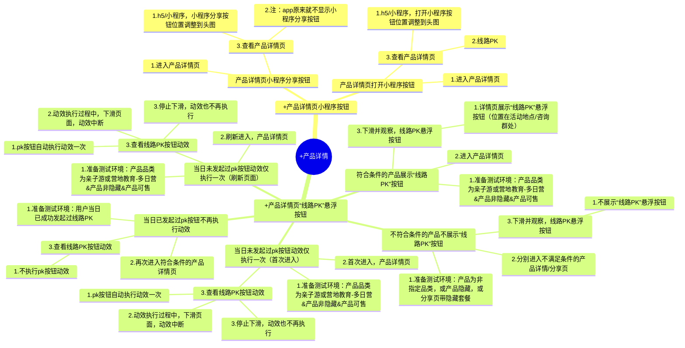

# XMind Screenshot Style

This reference solidifies the user's screenshot sample from 2026-04-13 as the authoritative XMind testcase style for this repo.

Use it whenever future testcase output should follow the same XMind structure and wording style.

## Core Rules

- Default deliverable: real `.xmind` file.
- Do not fall back to table-style testcase output.
- Do not create explicit topic labels named `测试步骤` or `预期结果` in the final `.xmind`.
- The actual visual node chain should be:
  - root topic
  - `+页面/模块`
  - `+功能节点`
  - testcase title
  - one child node containing all numbered test steps
  - one child node under the steps node containing all numbered expected results
- Preconditions belong in step 1 or the first few numbered lines.
- Module/function nodes usually keep the `+` prefix. Testcase nodes usually do not.
- Wording should stay close to the requirement and to the user's screenshot wording rhythm.

## Canvas Settings

The user's canvas/settings screenshot from 2026-04-13 should be treated as the default XMind canvas style for this repo.

- Canvas type: `逻辑图`
- Color scheme: `晨曦`
- Rainbow branches: enabled
- Background color: default light background
- Global font: default
- Branch line thickness: default
- Sibling topic alignment: enabled
- Prefer keeping the visual result close to the screenshot rather than using arbitrary XMind defaults

## Screenshot-Style Example

## Naming Rules

- Root node: use the real page or module name, often with `+`.
- Second-level node: use a concrete page/area node, such as `+产品详情页小程序按钮`.
- Third-level node: use a concrete function node, such as `+产品详情页“线路PK”悬浮按钮`.
- Testcase node: use one scenario sentence. Do not add IDs or priorities.
- Step node: one node containing all numbered steps.
- Expected-result node: one node containing all numbered expected results.

## Writing Rules

- Prefer short phrases such as `首次进入`、`刷新进入`、`查看...按钮动效`.
- Keep one testcase focused on one scenario trigger or one rule branch.
- If the screenshot separates similar branches into sibling testcase nodes, preserve that split.
- Keep the wording close to what the user has already written; do not over-formalize.
- Keep the final XMind canvas in `逻辑图` style rather than switching to other layouts such as tree/map/fishbone unless the user explicitly asks.
